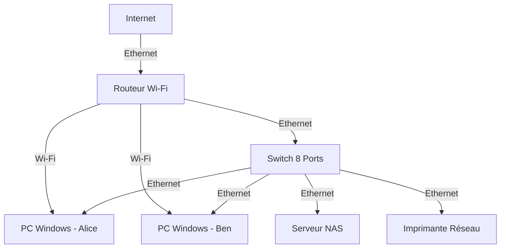
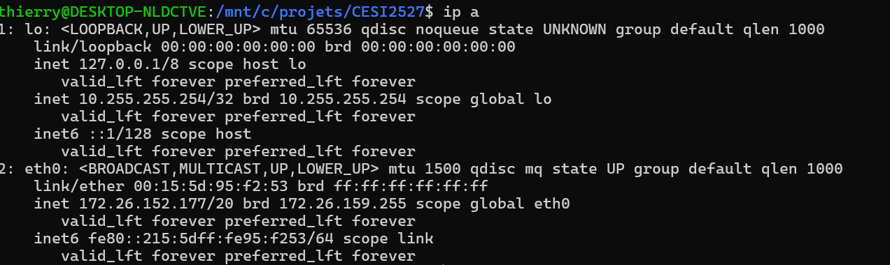
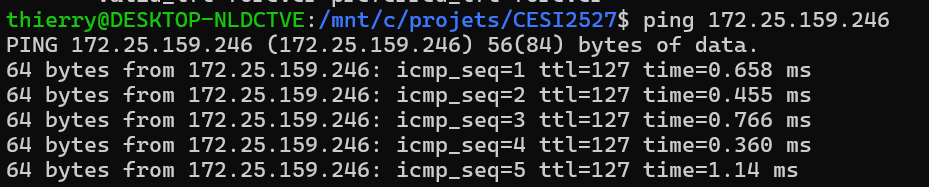
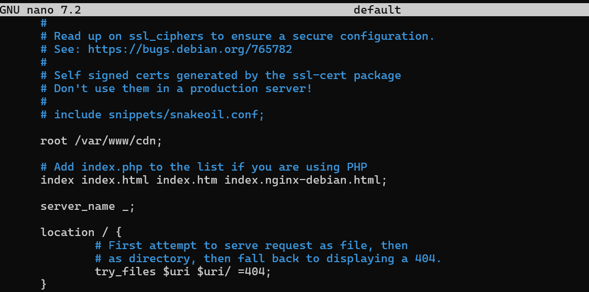
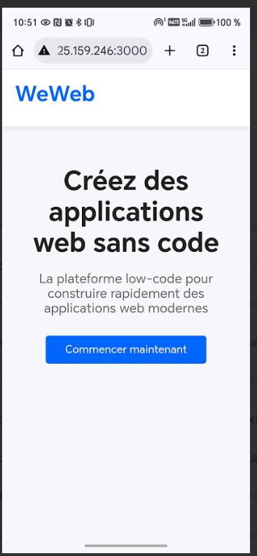
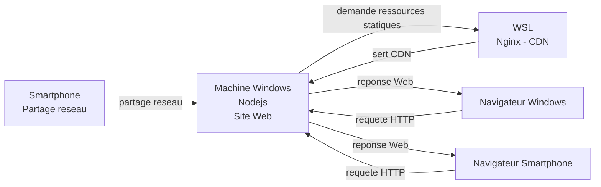
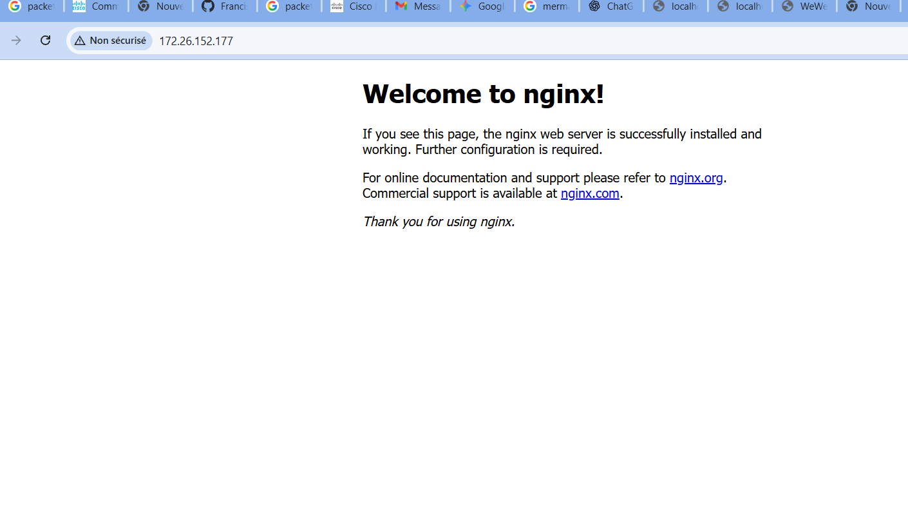
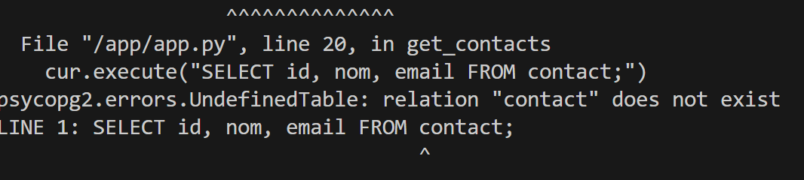

# 🚀 WeWeb : Le Commencement d'une Aventure Numérique


| **Aspect** | **Détail** |
|---|---|
| **Date de création** | 2024 |
| **Fondateurs** | Alice Dupont et Ben Lemaire |
| **Activité principale** | Conception et réalisation de sites web élégants et performants pour PME locales |

## I. L'Idée Fondatrice

Tout commence dans un petit garage transformé en bureau, où **Alice** (designer web talentueuse) et **Ben** (développeur passionné) décident de s'associer. 

**Constat** : Beaucoup de PME ont des sites datés, lents et mal optimisés.

**Objectif WeWeb** : Proposer des solutions numériques sur mesure axées sur :
- ⚡ **Vitesse de chargement**
- 🎯 **Expérience utilisateur (UX)**

## II. L'Infrastructure Initiale : Le "Starter Pack" du LAN

### 🔌 1. Connectivité et Cœur du Réseau

| Équipement | Rôle |
|---|---|
| **Routeur Wi-Fi** | Passerelle Internet & Distributeur DHCP |
| **Switch 8 Ports** | Câblage Ethernet pour connexion stable |


### 💼 2. Postes de Travail et Ressources

- **2 PC Windows** : Alice (Design) & Ben (Développement)
- **Imprimante Réseau** : Partage des contrats et maquettes
- **Serveur NAS** : Centralisation des fichiers clients, projets, sauvegarde

## III. Le Défi pour les TD

WeWeb fait face à ses premières limites :
- ⚠️ Performance web insuffisante
- 📦 Besoin d'une solution **CDN (Content Delivery Network)**

**Votre mission** : Accompagner WeWeb dans sa croissance en analysant et évoluant son infrastructure.

---

# 🛠️ Cahier de Travaux Dirigés - Infrastructure & Réseau WeWeb

Ce cahier couvre l'**évolution de l'infrastructure WeWeb** à travers des ateliers pratiques.

---

## 💻 Atelier 1 : Modélisation du Réseau Local (LAN) & Fondamentaux OSI

**Objectif** : Visualiser l'architecture de base et réviser les couches OSI.

### 1.1 Représentation Physique

**Tâche** : Dessiner ou modéliser le réseau initial avec **Cisco Packet Tracer**.

![Diagramme réseau petit bureau : 2 PC, serveur, imprimante → switch → routeur Wi-Fi]

**Composants** : 2 PC, NAS, imprimante, switch, routeur Wi-Fi

**Livrable** : Schéma montrant connexions filaires vs. Wi-Fi


## Diagramme



### 1.2 Identification des Rôles

| Question | Réponse |
|---|---|
| **Passerelle** ? | |
| **Point de concentration filaire** ? | |
| **Rôle du NAS** ? | |


J'ai déjà fourni la réponse au format Markdown dans ma première réponse, ainsi que dans ma deuxième réponse.

Voici la version complète en **Markdown** (format tableau) :

| Question | Réponse |
|---|---|
| **Passerelle** ? | Une **passerelle** (ou **gateway**) est un nœud de réseau qui sert de point d'arrêt pour les données avant de passer d'un réseau à un autre, agissant comme un **traducteur** pour communiquer entre des réseaux utilisant des protocoles différents. |
| **Point de concentration filaire** ? | Le **point de concentration filaire** est un équipement réseau (généralement un **Switch** ou, anciennement, un Hub) utilisé pour **interconnecter physiquement** et gérer la circulation des données entre plusieurs dispositifs au sein d'un même réseau local (LAN). |
| **Rôle du NAS** ? | Le **NAS** (**Network-Attached Storage**) est un serveur de stockage dédié connecté au réseau dont le rôle principal est de fournir un espace **centralisé et partagé** pour le stockage, la sauvegarde et l'accès aux fichiers pour tous les utilisateurs du réseau. |


**Livrable** : Tableau synthétique des rôles et protocoles (DHCP, NAT)

### 1.3 Exercice : Devinez la Couche OSI 🧐

Associez chaque description au **numéro de couche OSI** (1-7) :

| Description | Couche |
|:---|:---:|
| Transmission brute des bits (câbles, ondes radio) | |
| Accès au support (MAC) - Exemple : Ethernet | |
| Adressage logique (IP) et routage | |
| Communication bout à bout (TCP/UDP) | |
| Gestion des sessions | |
| Traduction, chiffrement, compression | |
| Services applicatifs - Exemple : HTTP, DNS | |

---

## 📱 Atelier 2 : Réseau PAM et Intégration WSL

**Objectif** : Maîtriser le **PAM (Point d'Accès Mobile)** et la mise en réseau **WSL**.

### 📌 Qu'est-ce qu'un PAM ?

**PAM = Hotspot mobile** transformant votre smartphone en routeur Wi-Fi (NAT/DHCP) utilisant la 4G/5G.

### 2.1 Mise en Place du PAM

✅ Activer le **Point d'Accès Mobile** sur votre smartphone  
✅ Connecter votre **PC Windows** en Wi-Fi

### 2.2 Analyse du Réseau Hôte

**Commandes** :
```bash
ipconfig          # Identifier IP PC et passerelle
ping [smartphone] # Tester la connectivité
```

**Livrable** : Adresses IP + résultat `ping`

Je créé un page web minimale avec node comme

app.js + index.html

Mon adresse :
172.25.159.246

Sur mon smartphone :
172.25.159.246:3000


### 2.3 Intégration WSL 2

## Vérifier configuration Windows


**Commandes WSL** :
```bash
ip a              # Trouver l'IP du WSL
ping [PC_IP]      # Ping vers Windows
ping [Passerelle] # Ping vers smartphone
```



```bash
ping 172.25.159.246 
```


**Tests de connectivité à valider** :
1. ✓ PC Windows → WSL
2. ✓ WSL → PC Windows
3. ✓ WSL → Passerelle PAM

**Livrable** : IP du WSL + résultats des 3 tests


## Configurer ngnix pour les ressources cdn


---

## 🌐 Atelier 3 : CDN Statique Local

**Objectif** : Déployer un **CDN local** pour améliorer la performance des ressources statiques.

## Exemple sur Smartphone



### 3.1 Conception et Sécurité du CDN

**Tâche** : Dessiner l'architecture CDN (serveur source → caches → utilisateurs)



# Mettre en place un système de cache dans Ngnix

#### Configuration Nginx pour Cache CDN

**Étape 1** : Modifier la configuration Nginx
```bash
sudo nano /etc/nginx/sites-available/default
```

**Étape 2** : Ajouter les directives de cache
```nginx
# Configuration du cache
proxy_cache_path /var/cache/nginx levels=1:2 keys_zone=cdn_cache:10m max_size=1g inactive=60m;

server {
    listen 80;
    server_name _;
    
    # Servir les fichiers statiques avec cache
    location ~* \.(css|js|jpg|png|gif|ico|svg|woff|woff2)$ {
        root /var/www/cdn;
        expires 30d;  # Cache navigateur
        add_header Cache-Control "public, immutable";
    }
    
    # Proxy avec cache serveur
    location /api/ {
        proxy_pass http://127.0.0.1:3000;
        proxy_cache cdn_cache;
        proxy_cache_valid 200 10m;
        proxy_cache_use_stale error timeout updating http_500 http_502 http_503 http_504;
        add_header X-Cache-Status $upstream_cache_status;
    }
}
```

**Étape 3** : Tester et valider
```bash
sudo nginx -t
sudo systemctl restart nginx
curl -I http://[IP_WSL]/style.css  # Vérifier headers Cache-Control
```

**Vérifier le cache** :
```bash
ls -la /var/cache/nginx/  # Fichiers en cache
```


#### ❓ Question 1 : DMZ
Faut-il placer les serveurs CDN (contenu public) en **DMZ** ?  

**Oui, les serveurs CDN doivent être placés en DMZ.**

**Justification :**
- Les serveurs CDN servent du contenu **public** accessible depuis Internet
- La DMZ isole ces serveurs du réseau interne (LAN) pour limiter les risques de sécurité
- En cas de compromission d'un serveur CDN, l'attaquant ne peut pas accéder directement aux données sensibles du réseau interne
- Les pare-feu contrôlent les flux : Internet ↔ DMZ (autorisé) et DMZ ↔ Réseau interne (restreint)


#### ❓ Question 2 : Opérations Infrastructure
Citer et décrire **3 opérations essentielles** pour gérer le CDN :
- (ex: mise en cache, purge, journalisation)


**Livrable** : Schéma + analyses DMZ & opérations

### 3.2 Implémentation avec WSL et PAM

**Étape 1** : Installer un serveur web dans WSL
```bash
# Ubuntu/Debian
sudo apt update && sudo apt install nginx
sudo systemctl start nginx
```
### Test de la page par défaut ngnix




**Étape 2** : Créer contenu statique
```bash
mkdir -p /var/www/cdn
echo "/* CSS */" > /var/www/cdn/style.css
echo "// JS" > /var/www/cdn/script.js
```

**Étape 3** : Tester depuis le smartphone
```
http://[IP_WSL]/style.css
http://[IP_WSL]/script.js
```

**Livrable** : Commandes + Preuve d'accès réussi

C'est une excellente clarification \! Le choix de l'outil de test est crucial. **Cypress** et **Selenium** sont les deux géants dans le domaine de l'automatisation des tests **End-to-End (E2E)**.

Pour la nature de cet atelier (vérification rapide du front-end et de l'intégration CDN), nous allons choisir **Cypress** pour sa simplicité d'installation et sa rapidité d'exécution, tout en notant que **Selenium** est l'outil de prédilection pour les tests multi-navigateurs plus complexes.

Voici la mise à jour de l'**Atelier 4** intégrant cette spécification.

-----

## ⚙️ Atelier 4 : Tests Automatisés et Environnement Isolé (VM)

**Objectif** : Déployer un environnement de test isolé (VM) capable d'exécuter des tests de performance et de fonctionnalité sur le site web servi par le CDN local (WSL/Nginx).

-----

### 4.1. Justification de la Machine Virtuelle (VM)

L'utilisation d'une **Machine Virtuelle (VM)** est une pratique standard en développement et en assurance qualité pour plusieurs raisons fondamentales :

1.  **Isolation** : La VM crée un environnement de test **séparé** et **isolé** du système d'exploitation hôte.
2.  **Reproductibilité** : Elle permet de figer un état précis du système via un **snapshot**, garantissant des conditions de test identiques à chaque exécution.
3.  **Simulation** : Elle simule facilement des environnements clients ou serveurs spécifiques.
4.  **Sécurité** : Tester du code ou des configurations réseau risquées se fait sans danger pour le réseau interne.

-----

### 4.2. Choix Technologiques pour la VM

| Catégorie | Technologie suggérée | Rôle & Justification |
| :--- | :--- | :--- |
| **Hyperviseur** | **VirtualBox** (Gratuit) ou **Hyper-V** | Crée et gère la VM sur le PC hôte. |
| **OS Invité** | **Ubuntu Desktop** (pour l'affichage graphique de Cypress) | Système sur lequel les outils seront installés. La version **Desktop** est requise pour pouvoir lancer l'interface graphique de Cypress. |
| **Outil de Test E2E** | **Cypress** | Pour l'atelier : **Cypress** est plus simple et rapide à installer (Node.js) et offre une excellente expérience pour les tests modernes du site web. *Alternative :* **Selenium** est à préférer si l'objectif est de tester une compatibilité stricte sur tous les navigateurs (Chrome, Firefox, Edge, etc.). |
| **Outil de Test de Performance** | **Apache JMeter** | Simule des charges lourdes pour mesurer la vitesse de chargement et l'efficacité du cache CDN. |

-----

### 4.3. Implémentation Pratique : Configuration Cypress

**Tâche** : Préparer la VM pour exécuter un test **Cypress** qui vérifie l'accessibilité du site web via le CDN local.

1.  **Installation de l'Hyperviseur et de l'OS** : Installer **VirtualBox** et créer une VM avec **Ubuntu Desktop**.
2.  **Configuration Réseau** : S'assurer que la VM est configurée en mode **NAT** ou **Bridge** pour accéder à l'IP du WSL/Nginx (votre CDN local).
3.  **Installation des Prérequis** (dans la VM Ubuntu) : Installer **Node.js** et **npm** (nécessaires pour Cypress).
    ```bash
    sudo apt update
    sudo apt install nodejs npm
    ```
4.  **Installation de Cypress** : Créer un répertoire de projet et installer Cypress localement.
    ```bash
    mkdir weweb-e2e-tests
    cd weweb-e2e-tests
    npm init -y
    npm install cypress --save-dev
    ```
5.  **Création du Test** : Ouvrir Cypress, créer un fichier de test (`cdn_access.cy.js`) et y écrire un test simple.

#### Exemple de Script Cypress

Ce script simule un utilisateur et vérifie que le site, et par extension ses ressources statiques (servies par le CDN), sont accessibles :

```javascript
// cdn_access.cy.js
describe('Vérification de l\'accessibilité du site via CDN', () => {
  it('Doit charger la page principale et vérifier l\'accès à une ressource CDN', () => {
    // Remplacer [IP_WSL] par l'adresse IP de votre WSL/Nginx
    const wsl_ip = 'http://[IP_WSL]'; 
    
    // 1. Accéder au serveur CDN local
    cy.visit(wsl_ip); 
    
    // 2. Vérifier que la page par défaut Nginx s'affiche (Titre)
    cy.title().should('include', 'Welcome to nginx!');
    
    // 3. Vérifier que la ressource statique (CSS) est accessible (simulé par un cy.request)
    // Cela confirme que la route et le cache Nginx fonctionnent pour les fichiers statiques.
    cy.request({
      url: `${wsl_ip}/style.css`,
      failOnStatusCode: true, // Doit retourner 200
    }).its('headers')
      .its('content-type')
      .should('include', 'text/css');
  });
});
```

**Livrable** :

1.  La justification (en 3 points maximum) du choix de **Cypress** sur **Selenium** pour cet atelier.
2.  Le résultat du test Cypress (succès/échec) dans l'interface graphique de la VM après exécution du script ci-dessus.
   

## Installation node sur Centos
iutiliser loadkeys fr sur centos pour clavier en français

curl -sL https://rpm.nodesource.com/setup_20.x | sudo bash -

sudo yum install nodejs

# Alice et Ben se mettent au Container

Ils installent docker desktop et vérifie l'installation:

docker --version
docker info

Ils testent l'image officielle

docker run hello-world

il vérie la création d'une image avec 

docker ps -a

Ils affichent les images

docker images

C'est une excellente idée d'introduire **Docker** pour le déploiement de l'Atelier 5. Cela reflète les pratiques modernes de microservices et de conteneurisation.

J'ai mis à jour l'Atelier 5 en intégrant l'utilisation de Docker (avec PHP, Nginx, et MySQL) dans les sections de conception et d'intégration.

Voici l'**Atelier 5** complet et autonome au format Markdown.

-----


# 🚢 Atelier 5 : Création d'une API Météo Marine en Microservice (Conteneurisé)

**Objectif :** Concevoir, modéliser et implémenter une API de météo marine sous forme de microservice, en utilisant **PHP** et **MySQL**, et en conteneurisant l'ensemble avec **Docker**. Ce service fournira des bulletins exploitables pour les applications de WeWeb.

### 5.1 Conception de l'Architecture Microservice (Conteneurisée)

* **Contexte :** Le déploiement de l'API s'effectuera via Docker et Docker Compose, garantissant l'isolation des dépendances (PHP, MySQL).
* **Tâche :** Dessiner l'architecture de ce microservice, en incluant :
    * Le client (application web/mobile de WeWeb)
    * L'API Gateway (point d'entrée unique)
    * Le Microservice "Météo Marine" (Conteneur PHP/Nginx)
    * La base de données MySQL (Conteneur dédié)
    * Une source de données externe (ex: API de météo marine publique simulée)

```mermaid
graph TD
    Client[Application Client WeWeb] --> ApiGw[API Gateway]
    
    subgraph Environnement de Production (Docker)
        ApiGw --> Proxy[Reverse Proxy / Load Balancer]
        Proxy --> Microservice[Microservice Météo Marine (Conteneur PHP/Nginx)]
        Microservice --> DB[(Base de Données MySQL (Conteneur))]
        Microservice --> ExternalAPI[Source de Données Météo Externe Simulée]
    end
    
    style Microservice fill:#f9f,stroke:#333,stroke-width:2px
    style DB fill:#ccf,stroke:#333,stroke-width:2px
````

### 5.2 Modélisation de la Base de Données (MySQL)

  * **Tâche :** Concevoir le schéma de la base de données MySQL pour stocker les bulletins météo marins.
  * **Tables Minimales :**
      * `ports` : Stocke les emplacements maritimes.
      * `bulletins_meteo` : Stocke les prévisions (liées à un port).
  * **Champs Suggerés :**

| Table | Champs | Type / Contrainte | Rôle |
| :--- | :--- | :--- | :--- |
| **`ports`** | `id` | INT (PK, AI) | Identifiant unique |
| | `nom_port` | VARCHAR(255) | Nom du port |
| | `latitude`, `longitude` | DECIMAL(10, 6) | Position GPS |
| **`bulletins_meteo`** | `id` | INT (PK, AI) | Identifiant unique |
| | `port_id` | INT (FK vers `ports.id`) | Port concerné par le bulletin |
| | `date_bulletin` | DATETIME | Date/Heure de la prévision |
| | `force_vent` | INT | Force du vent (en Beaufort) |
| | `etat_mer` | VARCHAR(100) | Description (Ex: Belle, agitée) |

  * **Livrable :** Le schéma de la base de données (le tableau ci-dessus).

### 5.3 Développement du Microservice (PHP)

  * **Tâche :** Décrire les principales étapes pour créer la logique métier en PHP.
  * **Endpoints Définis (API REST) :**

| Méthode | Endpoint | Description |
| :---: | :--- | :--- |
| `GET` | `/api/meteo/ports` | Liste tous les ports disponibles. |
| `GET` | `/api/meteo/ports/{id_port}/bulletin` | Obtient le dernier bulletin pour un port spécifique. |

  * **Logique Métier :** Le script PHP doit recevoir une requête HTTP, interroger la base de données MySQL, et formater le résultat en **JSON** avant de le renvoyer.
  * **Livrable :** Une description textuelle détaillée des étapes de développement et des endpoints définis.

### 5.4 Déploiement et Intégration (Docker)

  * **Tâche :** Expliquer les composants nécessaires pour conteneuriser le service (Docker Compose).
  * **Composants Docker :**
    1.  **Service `app` :** Conteneur basé sur PHP-FPM, contenant le code de l'API.
    2.  **Service `web` :** Conteneur basé sur Nginx, servant de reverse proxy pour `app` et gérant les requêtes HTTP.
    3.  **Service `db` :** Conteneur basé sur MySQL, pour la persistance des données.
  * **Tâche :** Décrire comment le service `app` et le service `db` communiqueront (via le réseau interne Docker).
  * **Test d'Accès :**
      * Démarrer les services avec `docker compose up -d`.
      * Tester l'accès à l'API depuis le PC hôte ou le WSL en utilisant `curl` :
          * `curl http://localhost:[PORT_NGINX]/api/meteo/ports`
  * **Livrable :** L'explication des services Docker nécessaires et l'exemple de commande de test `curl`.

-----


## Pour débugger :

### Pour tester la base :
Je teste la base de donnée
```bash
docker exec -it postgres_contact psql -U user -d contactsdb
```
Je tape la commande pour voir si une table existe
```
\dt
```

### Je lance le debug sur docker
Avec l'id ou le nom du container
```bash
docker logs f5fac1160aba 
```


La table n'existe pas. Je peux supprimer les volumes et en recréer.

```bash
docker-compose down -v

docker-compose up -d --build

## Quelques bonnes pratiques

* Utiliser les volumes pour persister les données au delà du cycle de vie du conteneur.
* Utiliser les networks pour isoler les conteneurs.
* Utiliser les labels pour baliser les conteneurs.
* Utiliser les ports pour exposer les services aux réseaux.
* Utiliser les dépendances pour gérer les dépendances du conteneur.
* Utiliser les buildargs pour optimiser l'image du conteneur.
* Utiliser les environnements pour gérer les variables d'environnement.
* Utiliser les healthcheck pour vérifier l'état du conteneur.

