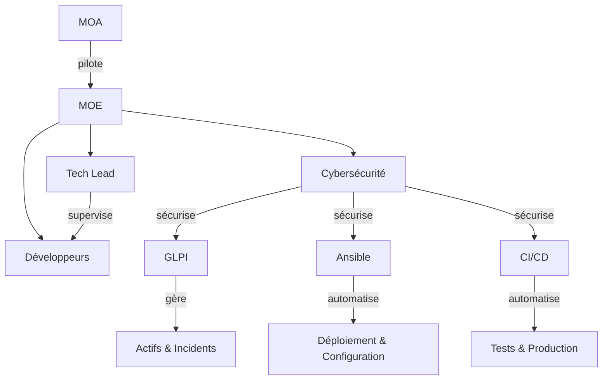

# Organisation et Scalabilité

## GLPI, Ansible, CI/CD et Rôles

GLPI est une solution de gestion des services informatiques (ITSM) qui centralise la gestion des actifs, des incidents et des demandes. Ansible permet d'automatiser le déploiement et la configuration des infrastructures de manière agile et reproductible. Les pipelines CI/CD (Intégration Continue/Déploiement Continu) automatisent les tests et les mises en production, garantissant une qualité constante et des cycles de livraison accélérés. La cybersécurité, élément transversal, sécurise chaque étape : authentification dans GLPI, chiffrement des communications Ansible, contrôle d'accès dans les pipelines CI/CD.

La MOE (Maîtrise d'Ouvrage Exécution) pilote l'exécution technique des projets en coordination avec la MOA. Le Tech Lead oriente les choix architecturaux et techniques, supervise les développeurs et assure la qualité du code. La cybersécurité valide la conformité des déploiements, définit les politiques de sécurité et effectue des audits réguliers. Cette organisation scalable permet une croissance maîtrisée tout en maintenant la sécurité.

## Schéma d'Organisation

## Problèmes d'Onboarding Tardifs

Un onboarding tardif crée plusieurs risques organisationnels et de sécurité :

- **Perte de productivité** : Les nouveaux salariés ne sont pas opérationnels rapidement, ralentissant les projets et surchargeant l'équipe existante
- **Lacunes de sécurité** : Absence de formation initiale aux politiques de sécurité et aux procédures d'accès, augmentant les vulnérabilités
- **Manque de documentation** : Sans processus structuré via GLPI, les informations critiques ne sont pas tracées et restent dans des silos
- **Défaut d'intégration technique** : Les accès Ansible et CI/CD ne sont pas provisionnés à temps, créant des délais
- **Perte de contexte** : L'absence de parrainage par un Tech Lead expose à des erreurs architecturales et des mauvaises pratiques
- **Compliance insuffisante** : Les audits cybersécurité révèlent des déploiements non conformes faute de validation préalable

**Solution** : Automatiser l'onboarding via GLPI pour tracer les étapes, définir des checklists sécurité, et intégrer la cybersécurité dès le jour 1.

## Problèmes de Outboarding Tardifs

Un outboarding tardif présente des risques équivalents :

- **Exposition de données sensibles** : Les accès ne sont pas révoqués rapidement, permettant aux anciens employés d'accéder aux systèmes (GLPI, Ansible, CI/CD)
- **Continuité compromise** : Absence de documentation des connaissances critiques avant le départ, créant des goulots d'étranglement
- **Non-conformité réglementaire** : Manquement aux obligations de traçabilité et d'audit des accès supprimés
- **Risques de sabotage** : Les permissions non révoquées peuvent être exploitées malveillamment
- **Charge administrative** : Un processus réactif ralentit les investigations et crée des coûts cachés

**Solution** : Intégrer le outboarding dans GLPI avec une checklist automatisée de révocation d'accès, archivage des données, et audit de conformité cybersécurité.

## Problèmes de Knowledge Transfer Insuffisant

### Définition du Knowledge Transfer (KT)

Le Knowledge Transfer (KT) est le processus de transmission structuré des connaissances techniques, métier et organisationnelles d'une personne ou d'une équipe vers d'autres. Il englobe la documentation des architectures, des procédures, des décisions et des bonnes pratiques, ainsi que leur communication via des sessions de formation, du pair programming ou du mentorat. Un KT efficace garantit que les compétences critiques restent disponibles au sein de l'organisation, indépendamment des changements de personnel, et facilite l'intégration de nouveaux membres.

Un manque de knowledge transfer crée des dépendances critiques et fragilise l'organisation :

- **Perte de compétences** : Quand un collaborateur clé quitte ou change de rôle, ses connaissances techniques et métier disparaissent avec lui
- **Duplication d'efforts** : Sans documentation centralisée, les équipes réinventent les solutions déjà développées, augmentant les coûts et les délais
- **Ralentissement des projets** : Les nouveaux membres perdent du temps à redécouvrir les architectures, les patterns et les décisions passées
- **Qualité dégradée** : L'absence de bonnes pratiques documentées conduit à des erreurs, des incohérences et des failles de sécurité
- **Effondrement du bus factor** : Peu de personnes maîtrisent les systèmes critiques, créant un point unique de défaillance
- **Coûts cachés d'expertise** : Consultants externes ou formations redondantes pour compenser les lacunes documentaires

**Solution** : Établir un processus structuré de documentation dans GLPI, organiser des sessions de pair programming supervisées par le Tech Lead, et intégrer la rédaction de documentation technique dans les définitions of done des projets CI/CD.

## Conclusion : L'Importance d'un Manager Communicant

Un manager communicant est essentiel pour assurer le lien efficace entre l'infrastructure et les travaux de développement. Il garantit :

- **Alignement stratégique** : Traduit les objectifs métier en exigences techniques et vice versa, bridgeant MOA et MOE
- **Fluidité de l'information** : Prévient les silos entre équipes infrastructure (GLPI, Ansible) et développement (CI/CD), évitant les malentendus coûteux
- **Anticipation des risques** : Communique proactivement sur les contraintes de sécurité, les dépendances et les impacts des décisions techniques
- **Cohésion d'équipe** : Crée une culture de transparence et de collaboration, essentielle lors des onboardings, knowledge transfers et outboardings
- **Traçabilité et conformité** : Assure que chaque action est documentée, communiquée et validée, répondant aux audits cybersécurité
- **Amélioration continue** : Recueille les retours d'expérience et les communique pour optimiser les processus et la scalabilité

Un manager communicant transforme les processus ITSM, Ansible et CI/CD en levier de performance organisationnelle plutôt qu'en source de friction.
